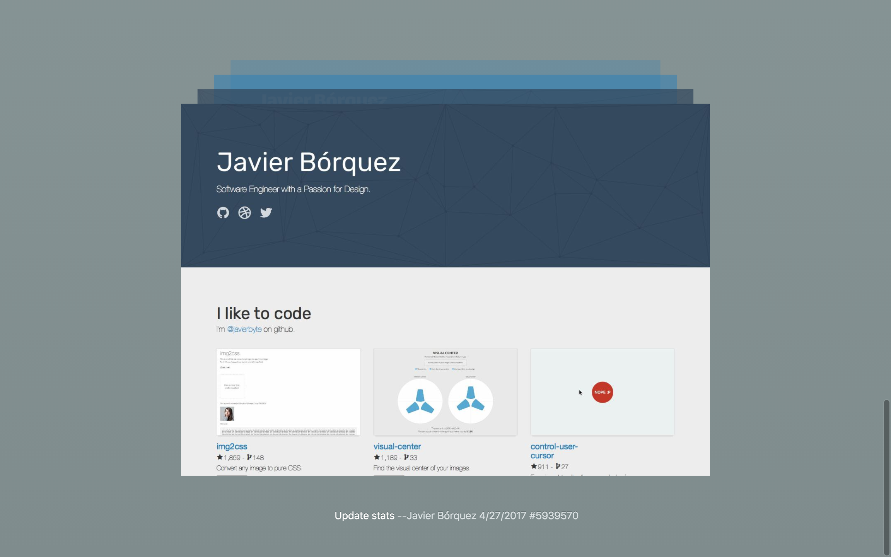

# Git Page Time-Machine.

See the evolution of your website in screenshots.

[Live demo](http://javier.xyz/gitpage-timemachine)

[](http://javier.xyz/gitpage-timemachine)

## How to use.

Clone the repo, and `cd` into it.

1. Config your data. Edit the `config.js` file.
```
module.exports = {
	repo: 'https://github.com/javierbyte/javierbyte.github.io',
	maxImages: 24,
	ignoreCommits: ['6da97a5eacd294c573ff830f79c5a3ecaec9c466', 'e9ccbd00a04007b313172b542d0e8e8c13cd3f8a']
};
```

It currently supports 3 properties:
* `repo` that is your repo url,
* `maxImages` that is the maximun number of screenshots that we are trying to get,
* `ignoreCommits` the entire hash of commits that you want to ignore.

2. Run and get your data. (Becare! This takes around 3 minutes for a 24 screenshot history!).

```
node cli.js
```

3. Run the frontend and see your history!
```
npm run dev
```

4. Profit!